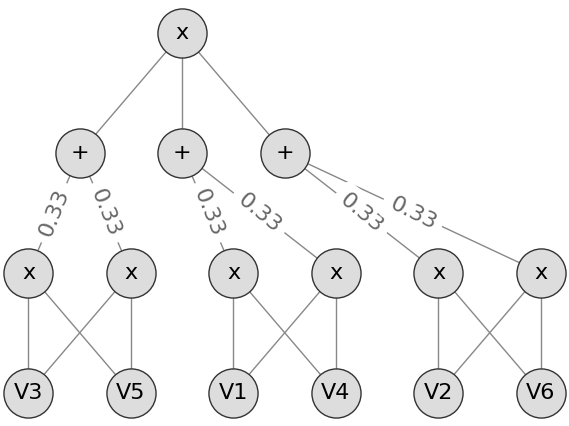
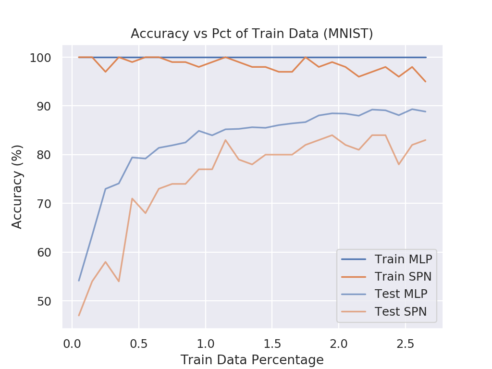

# Report: MLP vs SPN with few Training Samples

## Models

This report compares the following two models:

**MLP**: Three layer perceptron

1) Linear Layer (*n\_in*, 20)
2) Linear Layer (20, 5)
3) Linear Layer (5, 1)

**SPN**: Same as MLP but replace the second linear layer with a custom SPN layer

1) Linear Layer (*n\_in*, 20)
2) SPN Layer (20, 5)
3) Linear Layer (5, 1)

where the _SPN Layer_ (with dimensions *d\_in* and *d\_out*) is defined as follows:

- *d\_out* number of activations
- Each activation is a full SPN
- Each SPN has *d\_in* inputs and is defined as follows:
  - **Leaf Layer**: Each input is modeled with a single Gaussian
  - **Product Layer**: Select random pairs of leafs and model independencies via a product node
  - **Sum Node (Root)**: Sum over all previous products

Example visualization with 6 input variables and a random selection of independencies:

## Experimental Setup

The experimental setup was as follows:

- Train for 100 epochs
- Use only *p* percent of the available data for each class as training set
- Use full test set for evaluation
- Batch size always 1/10 of current number of training samples (w.r.t. *p*)
- Initial learning rate of 0.01
- Halven the learning rate after 25 epochs

## Results

