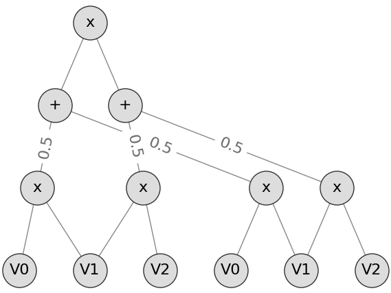
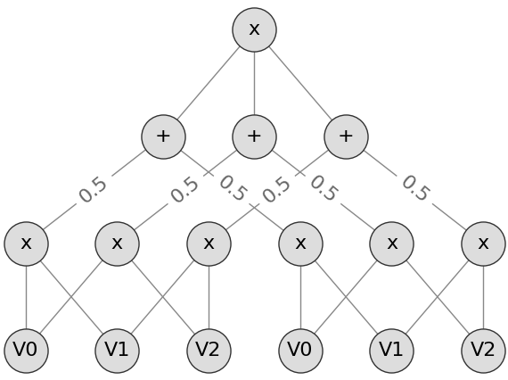

# Report: MLP vs SPN on Toy Datasets

## Models

This report compares the following two models:

**MLP**: Three layer perceptron

1) Linear Layer (*n\_in*, 20)
2) Linear Layer (20, 5)
3) Linear Layer (5, 1)

**SPN**: Same as MLP but replace the second linear layer with a custom SPN layer

1) Linear Layer (*n\_in*, 20)
2) SPN Layer (20, 5)
3) Linear Layer (5, 1)

where the _SPN Layer_ (with dimensions *d\_in* and *d\_out*) is defined as follows:

- *d\_out* number of activations
- Each activation is a full SPN
- Each SPN has *d\_in* inputs and is defined as follows:
  - Leaf Layer: Each input is modeled with two Gaussian leaf nodes which makes it two groups
  - Product Layer: 
    - Setup (A): Each consecutive input x\_i and x\_i+1 are connected via a product node for the two groups in the leaf layer separately
    - Setup (B): Each input combination x\_i and x\_j are connected via a product node for the two groups in the leaf layer separately
  - Sum Layer: Two product nodes from below with the same scope (that connect the same tuple of input leafs) are connected in a sum node
  - Root Node: Product over all previous sum nodes

### Setup (A) Example

- Connect consecutive inputs

### Setup (B) Example

- Connect all combinations of inputs

## Datasets

The models above are evaluated on the following datasets (binary classification):

- iris-2d
- wine-2d
- diabetes
- audit
- banknotes
- ionosphere
- sonar
- wheat-2d
- synth-8-easy
- synth-64-easy
- synth-8-hard
- synth-64-hard

See [data_loader](../../src/data/data_loader.py) for the dataset descriptions.
The synthetic datasets are generated with [sklearn.datasets.make_classification](https://scikit-learn.org/stable/modules/generated/sklearn.datasets.make_classification.html).

## Experimental Setup

The experimental setup was as follows:

- Train for 100 epochs
- Batch size 256
- Initial learning rate of 0.01
- Halven the learning rate after 25 epochs

## Results

The following figures compare the train and test accuracy of both models after each epoch.

### Setup (A)

#### Most Interesting

- MLP and SPN seem to be at least on par
- SPN outperforms MLP regarding test set performance on synth-64-easy, synth-8-easy
- MLP outperforms SPN regarding test set performance on synth-64-hard (but both models seem to heavily overfit on this dataset)
- SPN and MLP achieve the same test set performance on synth-8-hard

#### Others

#### Saturated

- These datasets seem to be too "easy" for the models, no real comparison possible

#### Degenerated Runs

- Probably too few training points

### Setup (B)

Waiting for runs to finish ...
