# Report: MLP vs SPN on Toy Datasets

## Models

This report compares the following two models:

**MLP**: Three layer perceptron

1) Linear Layer (*n\_in*, 20)
2) Linear Layer (20, 5)
3) Linear Layer (5, 1)

**SPN**: Same as MLP but replace the second linear layer with a custom SPN layer

1) Linear Layer (*n\_in*, 20)
2) SPN Layer (20, 5)
3) Linear Layer (5, 1)

where the _SPN Layer_ (with dimensions *d\_in* and *d\_out*) is defined as follows:

- *d\_out* number of activations
- Each activation is a full SPN
- Each SPN has *d\_in* inputs and is defined as follows:
  - **Leaf Layer**: Each input is modeled with two Gaussian leaf nodes which makes it two groups
  - **Product Layer**: 
    - Each input combination x\_i and x\_j are connected via a product node for the two groups in the leaf layer separately
  - **Sum Layer**: Two product nodes from below with the same scope (that connect the same tuple of input leafs) are connected in a sum node
  - **Root Node**: Product over all previous sum nodes

### SPN Setup Example

- Connect all combinations of inputs

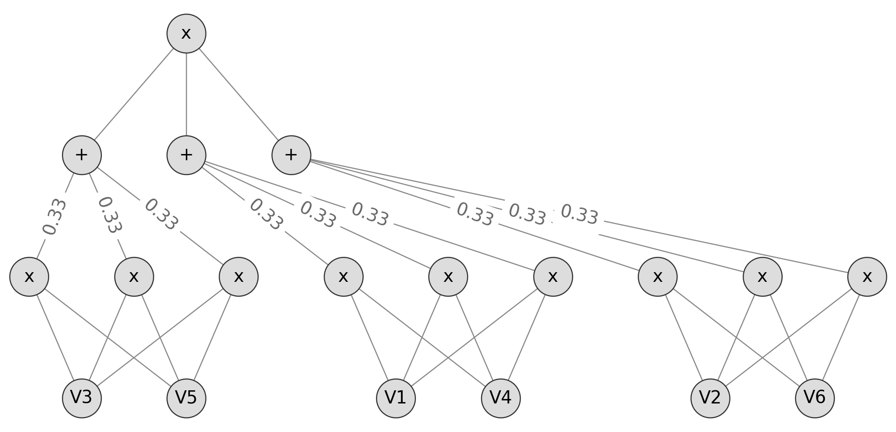

## Datasets

The models above are evaluated on the following datasets (binary classification):

| Name          | Samples   | Features  |
| ------------- | ---------:| ---------:|
| iris-2d       | 100       | 4         |
| wine-2d       | 107       | 13        |
| diabetes      | 768       | 8         |
| audit         | 773       | 25        |
| banknotes     | 1372      | 4         |
| ionosphere    | 351       | 34        |
| sonar         | 208       | 60        |
| wheat-2d      | 140       | 7         |
| synth-8-easy  | 3000      | 8         |
| synth-8-hard  | 3000      | 8         |
| synth-64-easy | 3000      | 64        |
| synth-64-hard | 3000      | 64        |

See [data_loader](../../src/data/data_loader.py) for the dataset descriptions.
The synthetic datasets are generated with [sklearn.datasets.make_classification](https://scikit-learn.org/stable/modules/generated/sklearn.datasets.make_classification.html).

## Experimental Setup

The experimental setup was as follows:

- Train for 100 epochs
- Batch size 256
- Initial learning rate of 0.01
- Halven the learning rate after 25 epochs
- 2/3 Train, 1/3 Test split

## Results

The following figures compare the train and test accuracy of both models after each epoch.

#### Synthetic Data

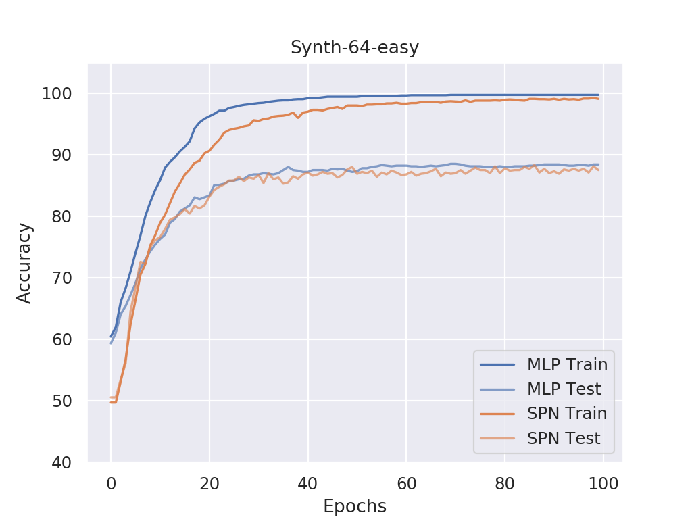
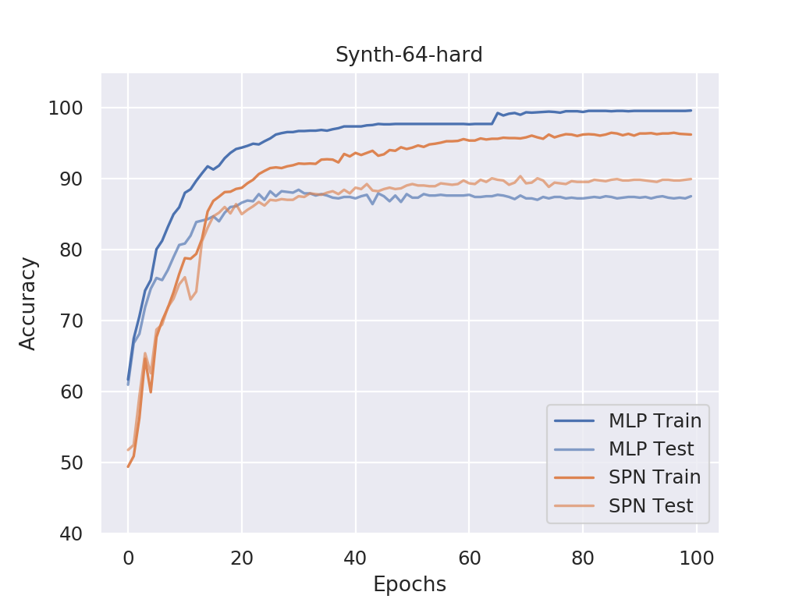
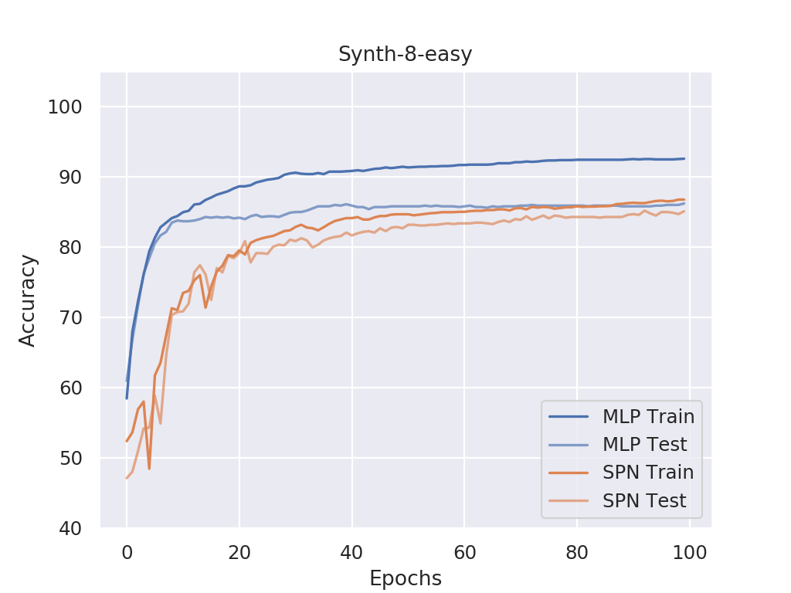
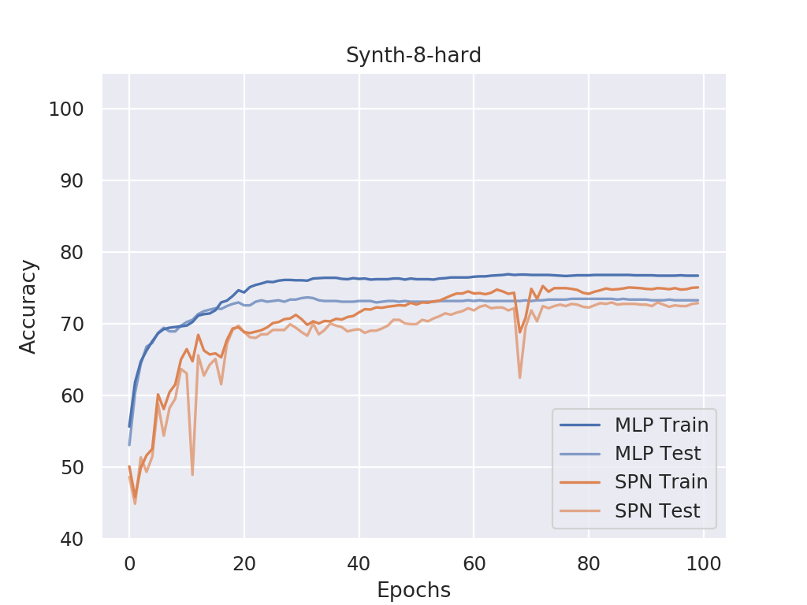

#### Others

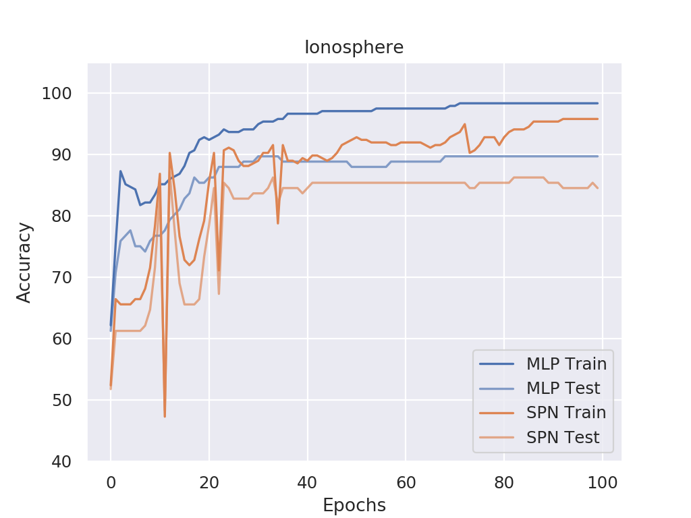
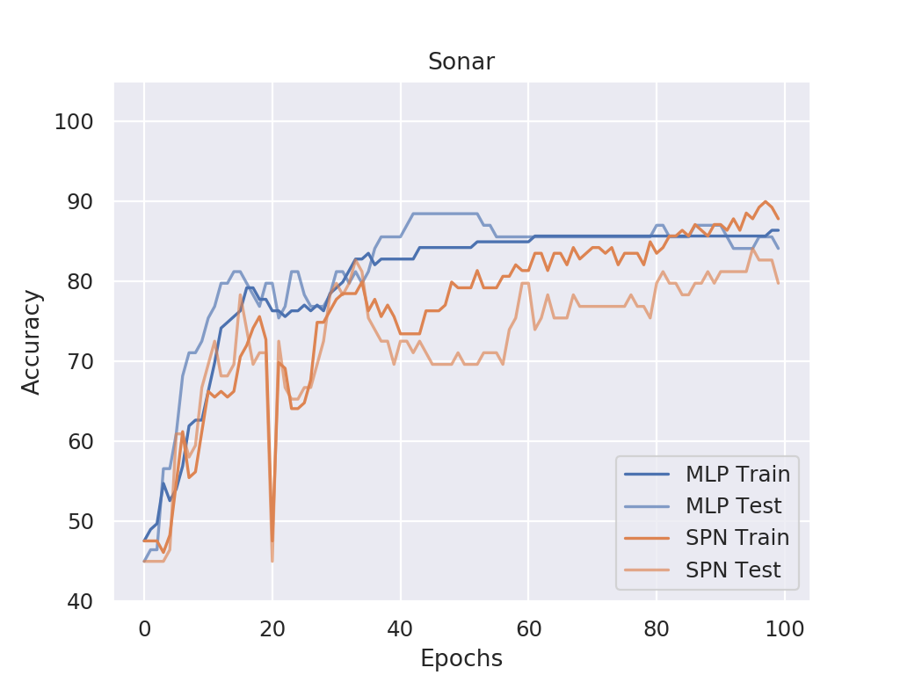
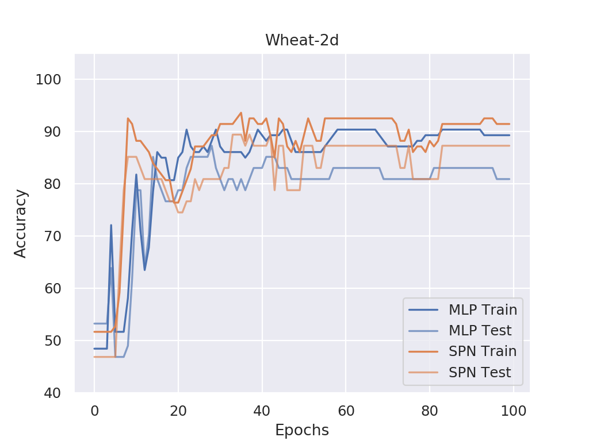
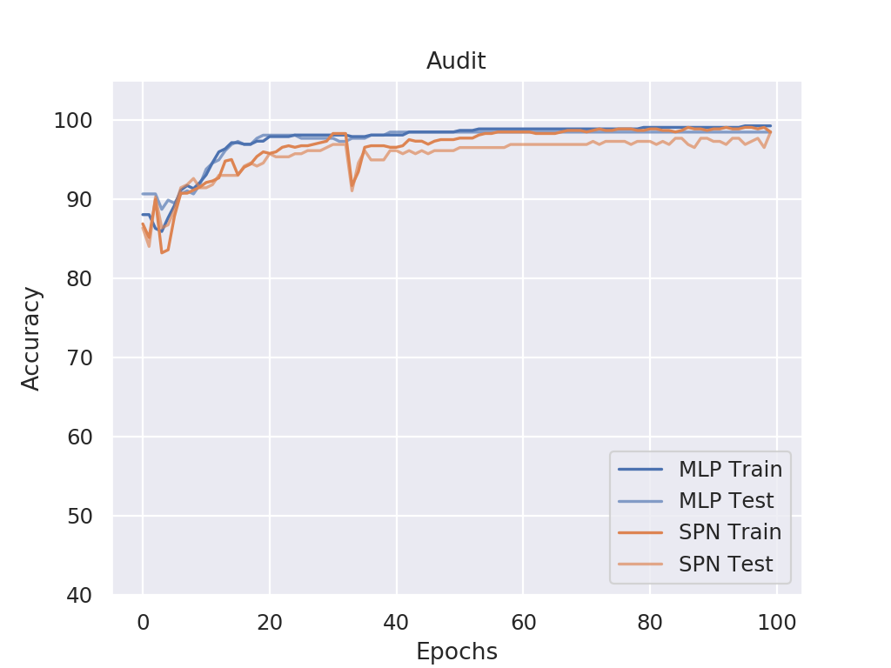
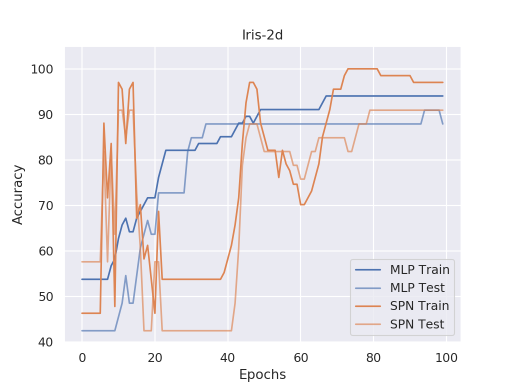

#### Saturated

- These datasets seem to be too "easy" for the models, no real comparison possible

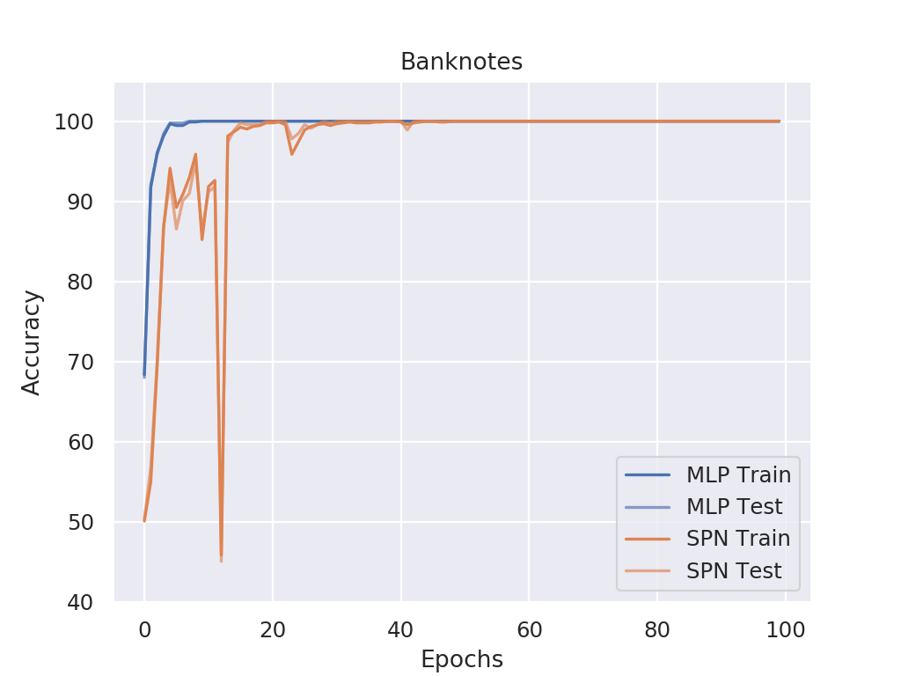

#### Degenerated Runs

- Probably too few training points

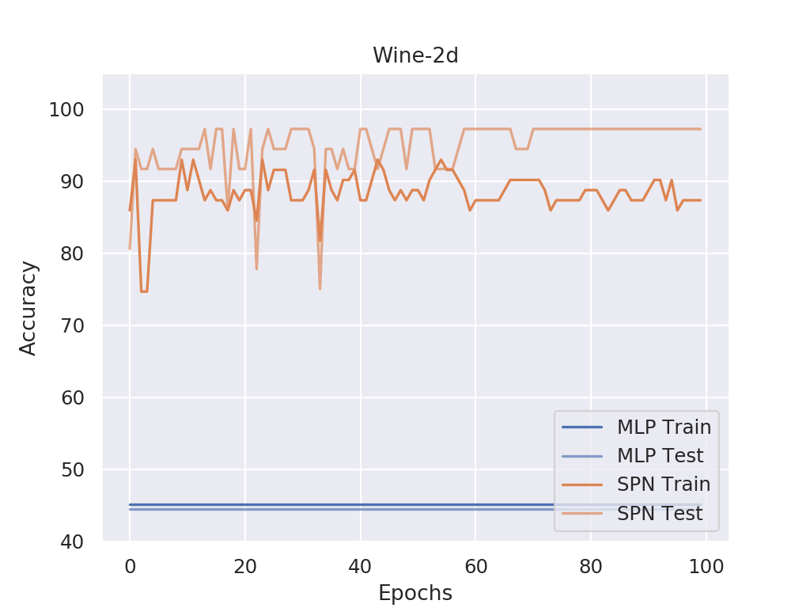
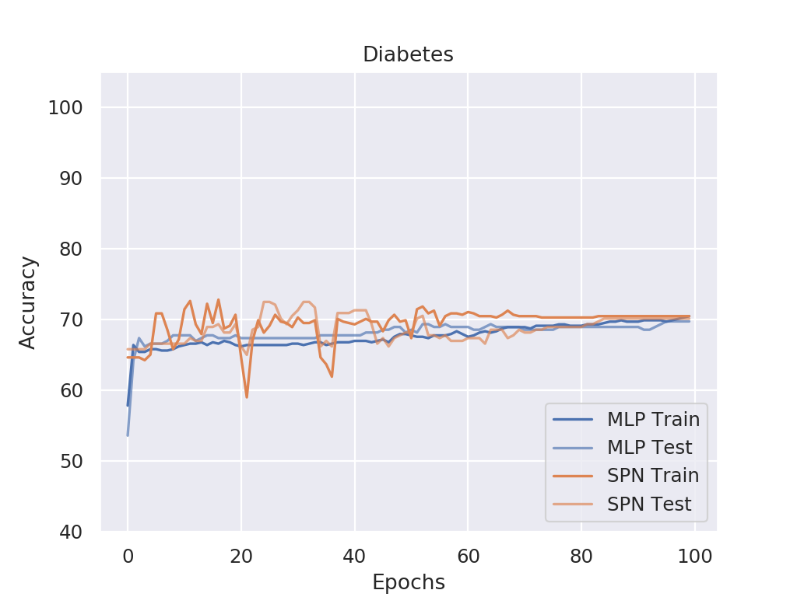
