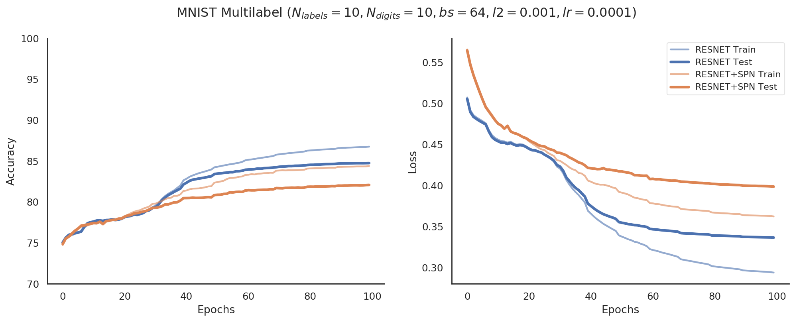
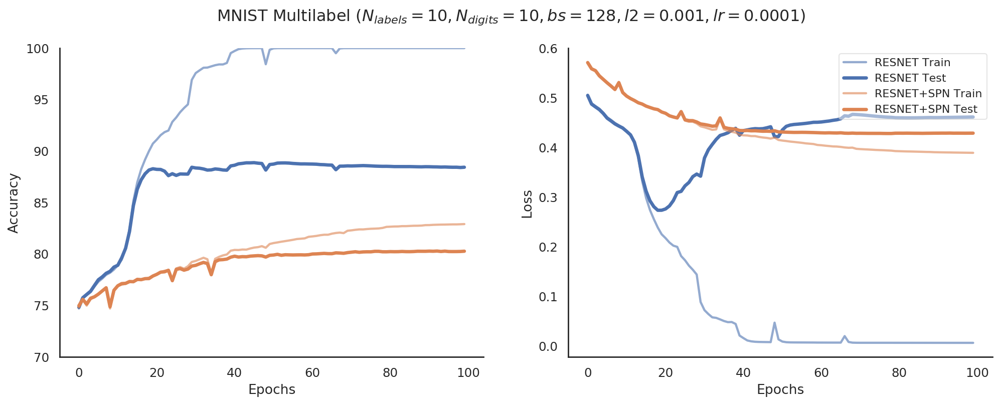
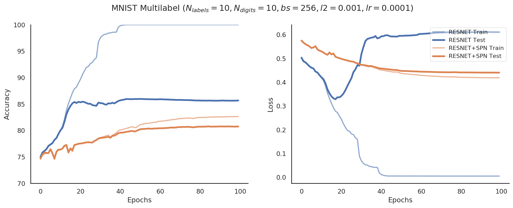
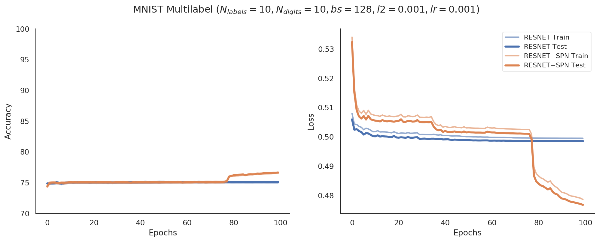
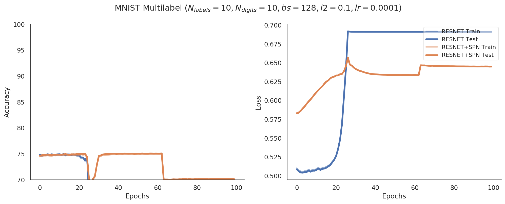
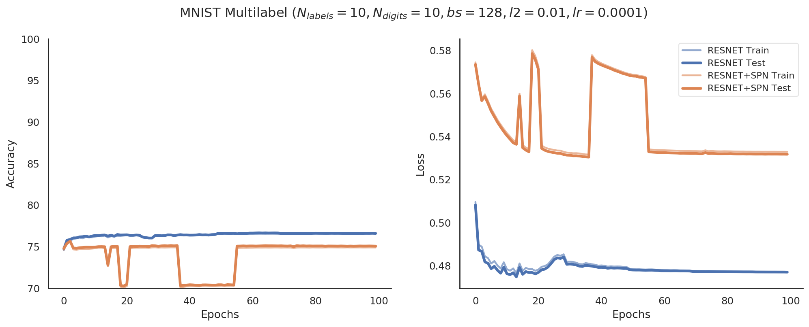
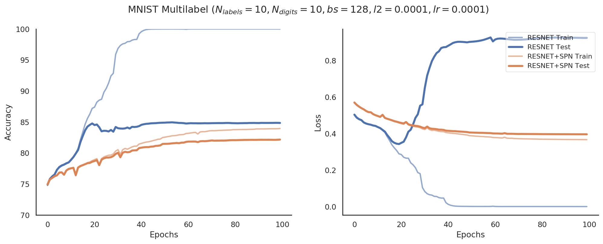
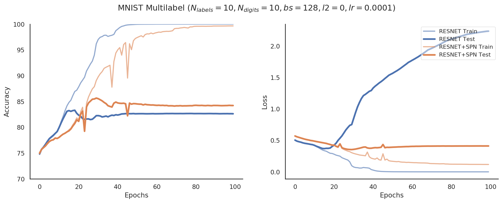

# Results

## Batch Sizes
- `lr=1e-4`
- `l2=1e-3`

### bs=64

### bs=128

### bs=256

## Learning Rate
- `bs=128`
- `l2=1e-3`

### lr=1e-3

### lr=1e-4

## L2 Regularizer
- `bs=128`
- `lr=1e-4`

### l2=1e-1
- Regularization too high

### l2=1e-2
- Regularization too high

### l2=1e-3
- Regularization improves Resnet but worsens Resnet+SPN (comp `l2=0` below)

### l2=1e-4

### l2=0
- No regularization works best for Resnet+SPN but worse for Resnet

