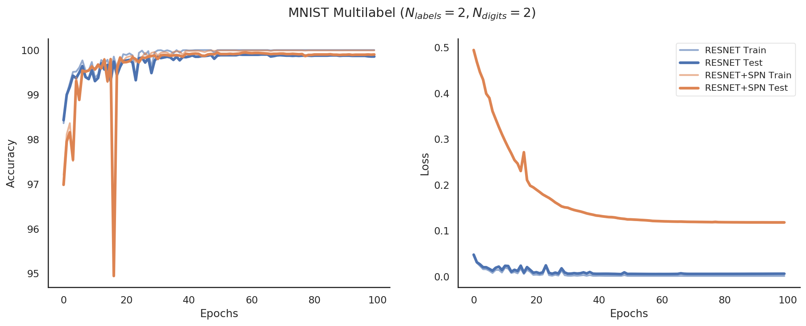
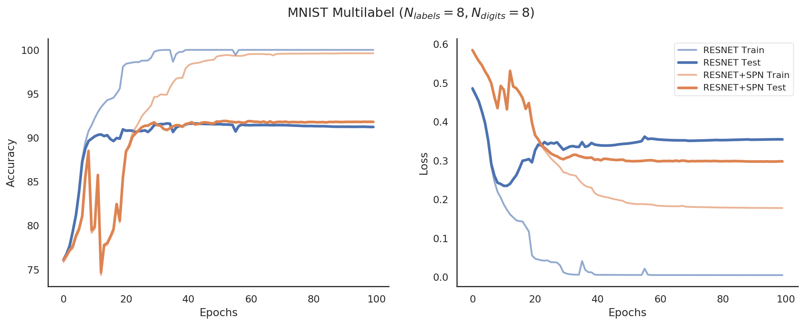

<!-- markdown-toc start - Don't edit this section. Run M-x markdown-toc-refresh-toc -->
**Table of Contents**

- [-](#-)
- [N_labels = N_digits = 2](#nlabels--ndigits--2)
- [N_labels = N_digits = 3](#nlabels--ndigits--3)
- [N_labels = N_digits = 4](#nlabels--ndigits--4)
- [N_labels = N_digits = 5](#nlabels--ndigits--5)
- [N_labels = N_digits = 6](#nlabels--ndigits--6)
- [N_labels = N_digits = 7](#nlabels--ndigits--7)
- [N_labels = N_digits = 8](#nlabels--ndigits--8)
- [N_labels = N_digits = 9](#nlabels--ndigits--9)
- [N_labels = N_digits = 10](#nlabels--ndigits--10)

<!-- markdown-toc end -->

# Results
- Setup: Same as [before](../mnist-multilabel-canvas/report.md), except batch size is set to 128 and l2 weight regularization (lambda=0.001).

### N_labels = N_digits = 2

### N_labels = N_digits = 3

### N_labels = N_digits = 4

### N_labels = N_digits = 5

### N_labels = N_digits = 6

### N_labels = N_digits = 7

### N_labels = N_digits = 8

### N_labels = N_digits = 9

### N_labels = N_digits = 10

## Different Batch Sizes

### Batch Size 64

### Batch Size 128

### Batch Size 256

### Batch Size 512

