# Report: MLP vs SPN on MNIST Multilabel 
<!-- markdown-toc start - Don't edit this section. Run M-x markdown-toc-refresh-toc -->
**Table of Contents**

- [Report: MLP vs SPN on MNIST Multilabel](#report-mlp-vs-spn-on-mnist-multilabel)
    - [Dataset](#dataset)
    - [SPN Architecture](#spn-architecture)
    - [Experiments](#experiments)
        - [Resnet vs Resnet + SPN on Increasing Difficulties](#resnet-vs-resnet--spn-on-increasing-difficulties)
            - [Results](#results)
            - [N_labels = N_digits = 2](#nlabels--ndigits--2)
            - [N_labels = N_digits = 3](#nlabels--ndigits--3)
            - [N_labels = N_digits = 4](#nlabels--ndigits--4)
            - [N_labels = N_digits = 5](#nlabels--ndigits--5)
            - [N_labels = N_digits = 6](#nlabels--ndigits--6)
            - [N_labels = N_digits = 7](#nlabels--ndigits--7)
            - [N_labels = N_digits = 8](#nlabels--ndigits--8)
            - [N_labels = N_digits = 9](#nlabels--ndigits--9)
            - [N_labels = N_digits = 10](#nlabels--ndigits--10)
        - [Resnet vs SPN vs Resnet + SPN vs Resnet & SPN](#resnet-vs-spn-vs-resnet--spn-vs-resnet--spn)
            - [Results](#results-1)
        - [SPN as Activation Conditionals](#spn-as-activation-conditionals)
            - [Results](#results-2)
        - [SPN vs MPN (Max Product Network = Maxout Network)](#spn-vs-mpn-max-product-network--maxout-network)
            - [Results](#results-3)
    - [Issues During the Above Experiments](#issues-during-the-above-experiments)
        - [Model Complexity](#model-complexity)
        - [Performance](#performance)

<!-- markdown-toc end -->


## Dataset

The dataset has been artificially crafted by randomly drawing digits from MNIST onto a 50x50 canvas. The dataset can be created with two parameters:

- `n-digits`: Number of possible digits on the canvas
- `n-labels`: Number of different possible labels, each digit can have (draw digits from `1..n_labels`)

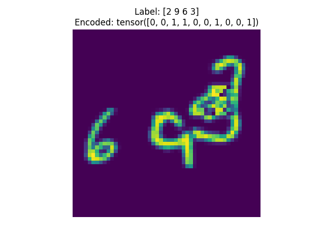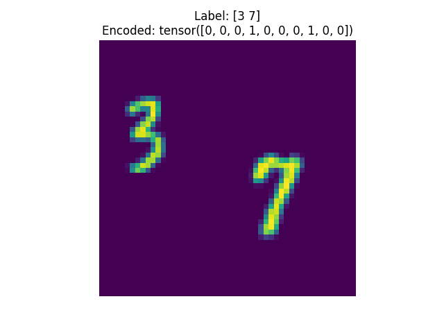
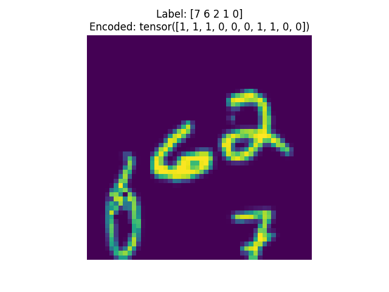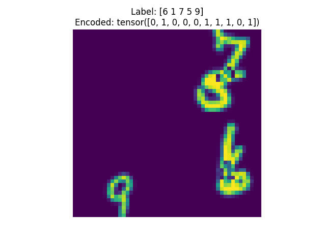


## SPN Architecture

Each _SPN Layer_ (with dimensions *d\_in* and *d\_out*) is defined as follows:

- *d\_out* number of activations
- Each activation is a full SPN
- Each SPN has *d\_in* inputs and is defined as follows:
  - **Leaf Layer**: Each input is modeled with a single Gaussian
  - **Product Layer**: Select random pairs of leafs and model independencies via a product node
  - **Sum Layer**: Sum over all previous products with same scope
  - **Product Node (Root)**: Product over all mixtures

Example visualization with 6 input variables and a random selection of pairwise independencies:

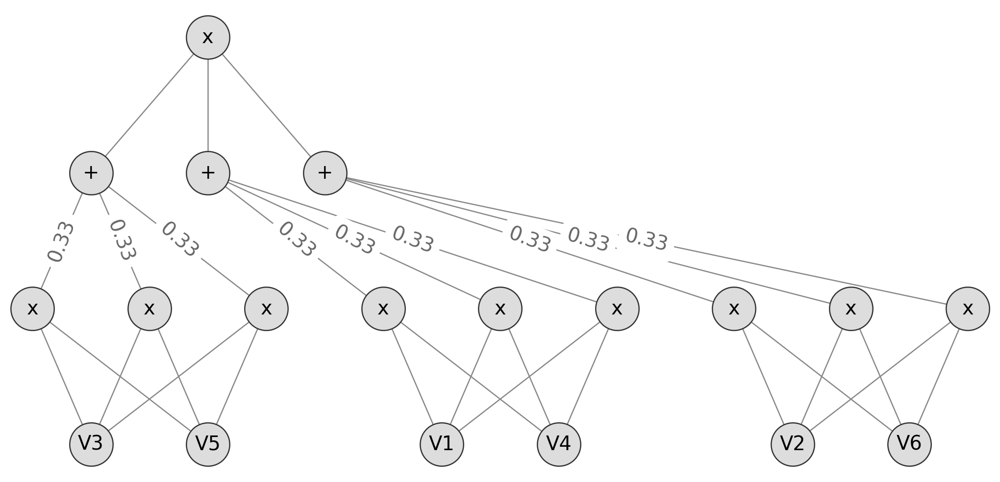

## Experiments


The general experimental setup was as follows (if not specified further):

- Epochs: 50
- Batch Size: 128
- Learning Rate: 0.0001 (decrease by 0.5 after every 10 epochs)

### Resnet vs Resnet + SPN on Increasing Difficulties

**Resnet**

| Name     | Dim In  | Dim Out    |
|:---------|--------:|-----------:|
| Resnet18 | 50 * 50 | 128        |
| Linear   | 128     | *n_labels* |


**Resnet + SPN**

| Name       | Dim In    | Dim Out      |
| :--------- | --------: | -----------: |
| Resnet18   | 50 * 50   | 128          |
| SPN        | 128       | *n_labels*   |


#### Results

#### N_labels = N_digits = 2
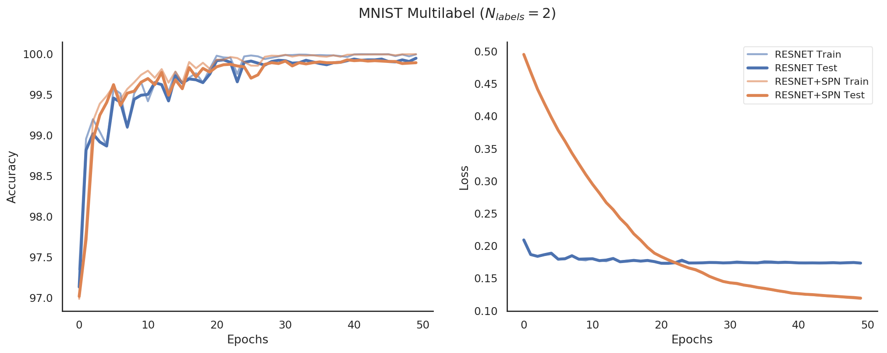

#### N_labels = N_digits = 3
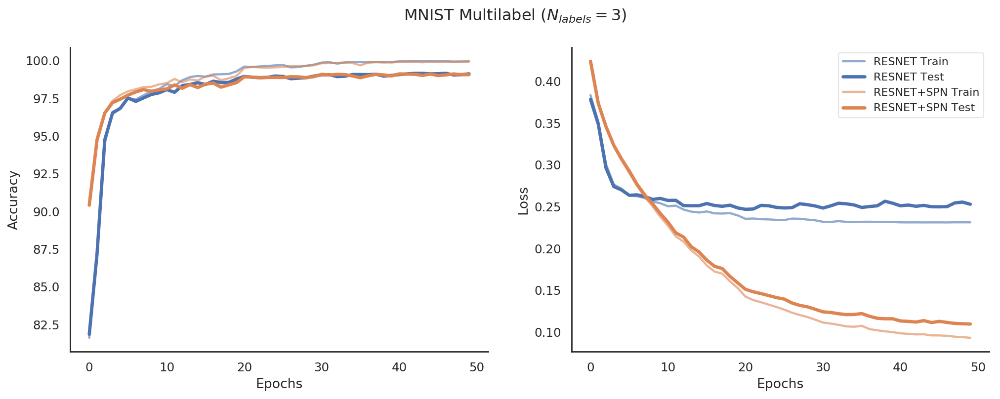

#### N_labels = N_digits = 4
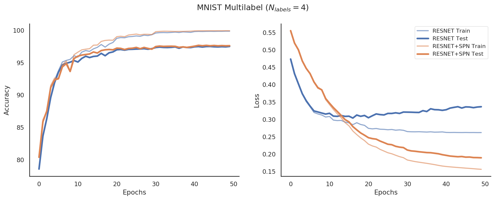

#### N_labels = N_digits = 5
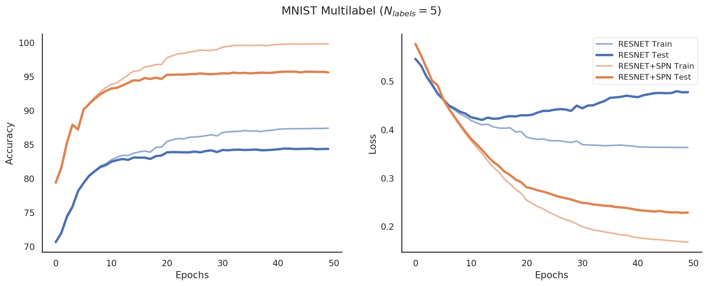

#### N_labels = N_digits = 6
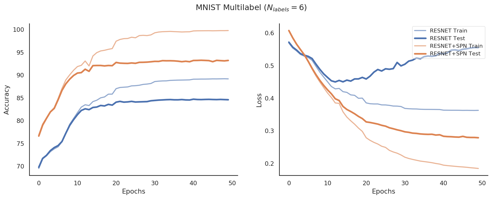

#### N_labels = N_digits = 7
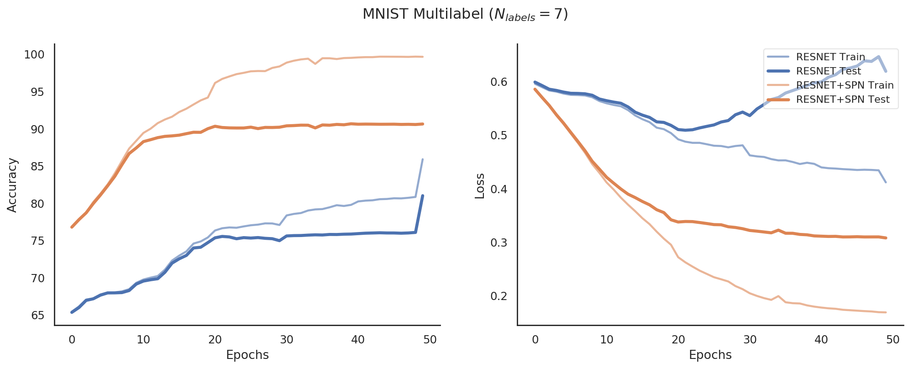

#### N_labels = N_digits = 8
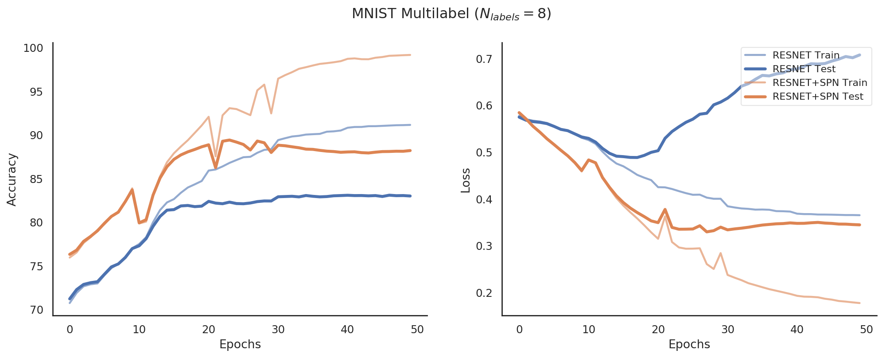

#### N_labels = N_digits = 9
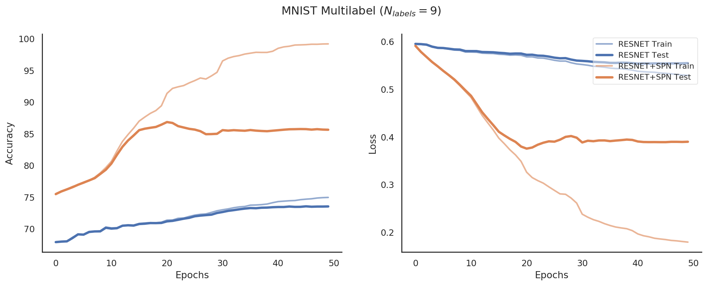

#### N_labels = N_digits = 10
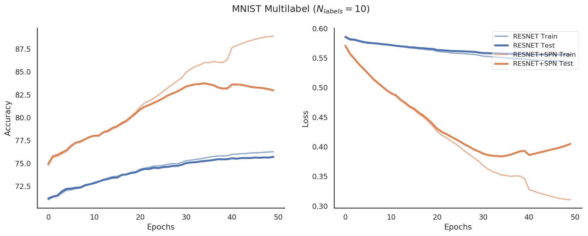

### Resnet vs SPN vs Resnet + SPN vs Resnet & SPN

Different Network Architectures:

**Resnet**: Only Resnet18

| Name     | Dim In  | Dim Out    |
|:---------|--------:|-----------:|
| Resnet18 | 50 * 50 | *n_labels* |

**SPN**: Only SPN layer with *n_labels* internal SPNs

| Name       | Dim In    | Dim Out      |
| :--------- | --------: | -----------: |
| SPN        | 50 * 50   | *n_labels*   |

**Resnet + SPN**: First Resnet18, then SPNs ontop of that

| Name       | Dim In    | Dim Out      |
| :--------- | --------: | -----------: |
| Resnet18   | 50 * 50   | 128          |
| SPN        | 128       | *n_labels*   |

**Resnet & SPN** (Parallel): Both, Resnet18 and SPN applied to the input and then combined

| Name                  | Dim In    |      Dim Out |
| :----------           | --------: | -----------: |
| Resnet18              | 50 * 50   |          128 |
| SPN                   | 50 * 50   |          128 |
| Concat (Resnet & SPN) | 128 + 128 |          256 |
| Linear                | 256       |   *n_labels* |

#### Results

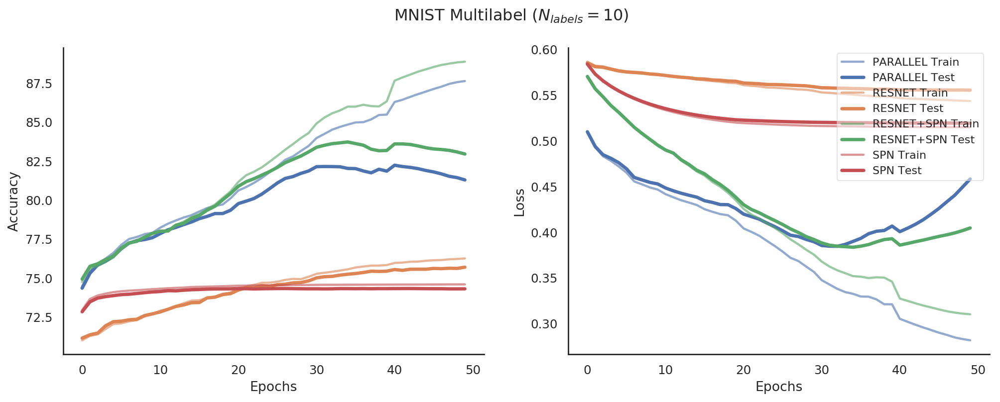

### SPN as Activation Conditionals

Idea: Map each output of a certain layer to the conditional of that output, given all other outputs. 

That is we compute `P(Z_i | Z \ {Z_i}) = P(Z) / P(Z \ Z{Z_i})` ("How likely is feature `Z_i`, given all other outputs that have been produced at that layer?"). Maps `d` inputs to `d` outputs. 

Architecture:

| Name       | Dim In    | Dim Out      |
| :--------- | --------: | -----------: |
| Resnet18   | 50 * 50   | 128          |
| Cond-SPN   | 128       | 128          |
| Linear     | 128       | *n_labels**   |

#### Results

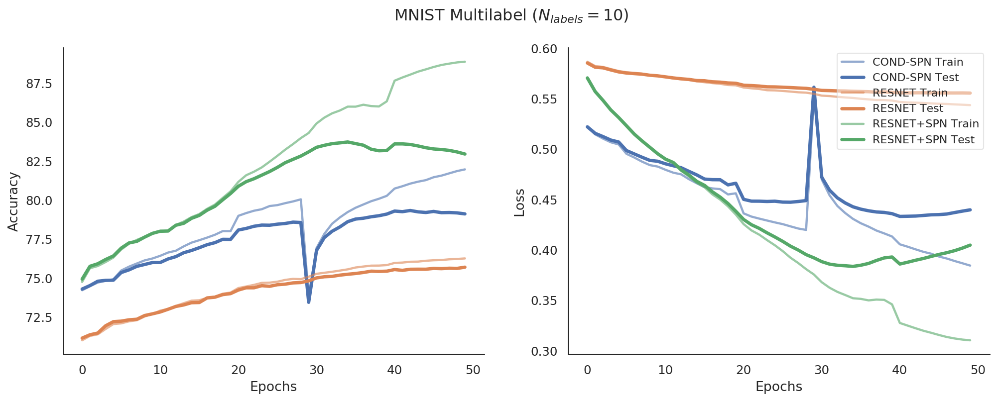


### SPN vs MPN (Max Product Network = Maxout Network)

*Idea*: The Maxout neuron from Bengio et al. is similar to the sum node in the forward pass if we consider the maxout `k` dimension as the number of possible representations of a certain scope in the SPN, see:

<div style="text-align: center">
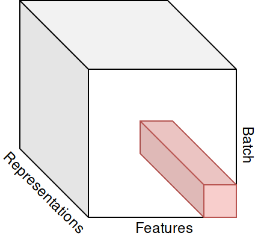
</div>

<div style="text-align: center">
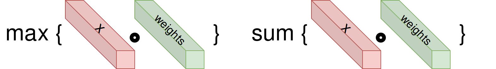
</div>

The results below compare the Resnet+SPN setup with the same setup but the sum operation has been replaced with a max operation (as it is done during MPE).

#### Results

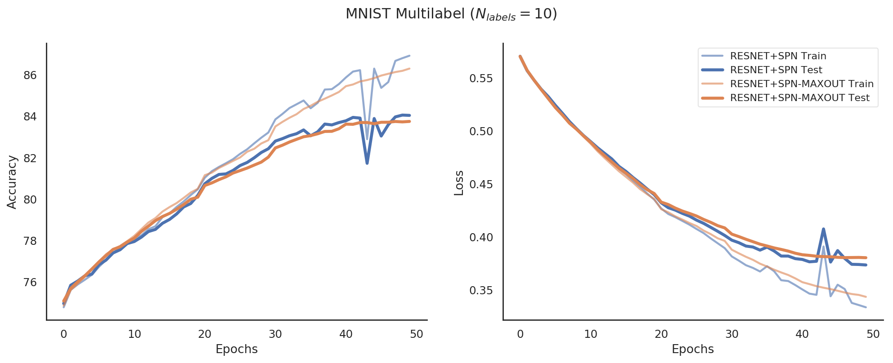

## Issues During the Above Experiments

### Model Complexity

The new multilabel MNIST dataset seemes to need quite a more complex/powerful model. Initial experiments were conducted with naive MLPs and some handcrafted Conv>Pool>...>Linear architectures. Each of these performed underwhelmingly bad. Therefore, it was necessary to include more capable architectures, Resnet18 in this case.

### Performance

Due to a higher model complexity the intermediate dimensions have grown. It was not feasable anymore to use a naive implementation of the SPN. Therefore, a vectorized layer-wise SPN implementation in PyTorch was necessary:

**Leaf Layer**
An input `X` with `d` features is transformed into `k` different representations (e.g. different Gaussians for the same feature). This results in a representation matrix of `k x d`, where the scopes are the same over the first axis and the scopes are different over the second axis.
Marginals over leafs can be easily be set:
```
X[:, i] = 1.0  # Marginalize feature i for all representations of i
```

**Product Layer**
A product between disjoint scopes `S_1, ..., S_l` can be represented as a the elementwise matrix multiplication:
```
X_prod = X[:, S_1] * ... * X[:, S_l]
# X_prod.shape == [k, d/l]
```

**Sum Layer**
A weighted sum between equal scopes can be represented as a elementwise product with the weights and a sum reduction along the representation dimension afterwards:

```
# X.shape == [k, d/l]
# weights.shape == [k, d/l] (k sum nodes over d/l children with equal scope)
X_sum = sum(X * weights, dim=0) 
# X_sum.shape == [d/l]
```
