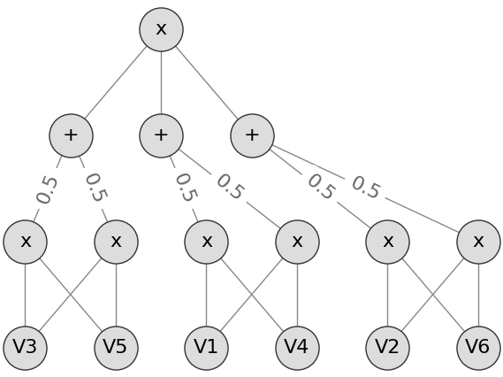
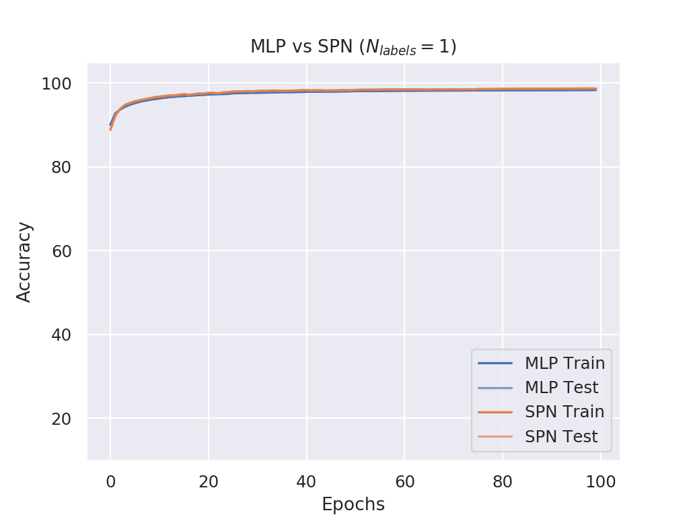
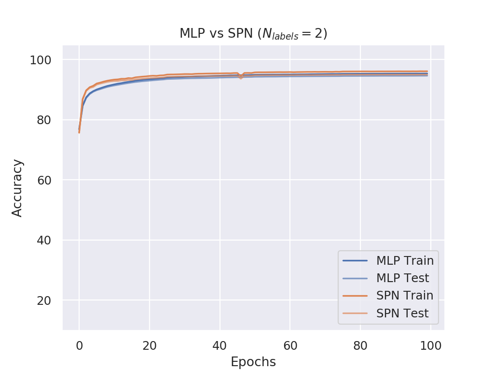
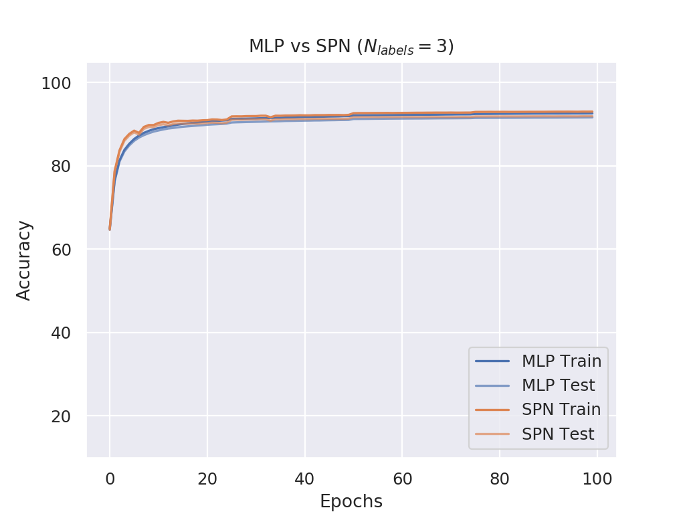
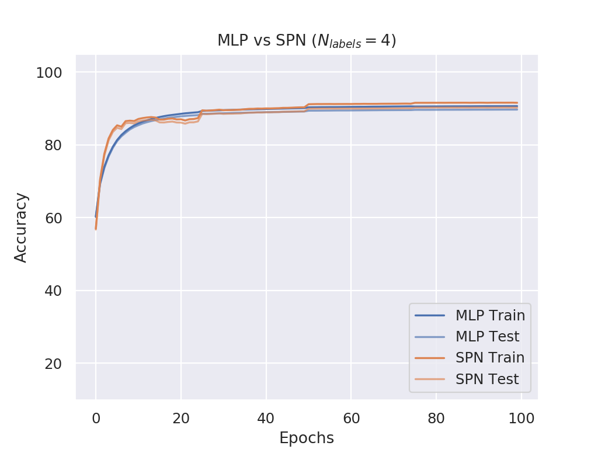
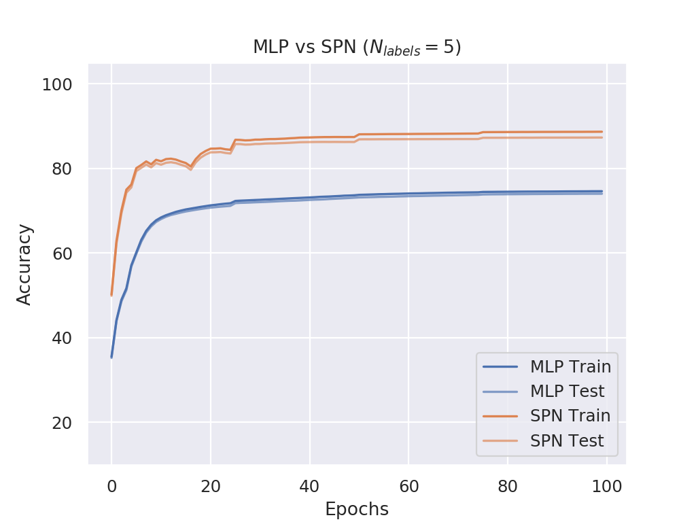
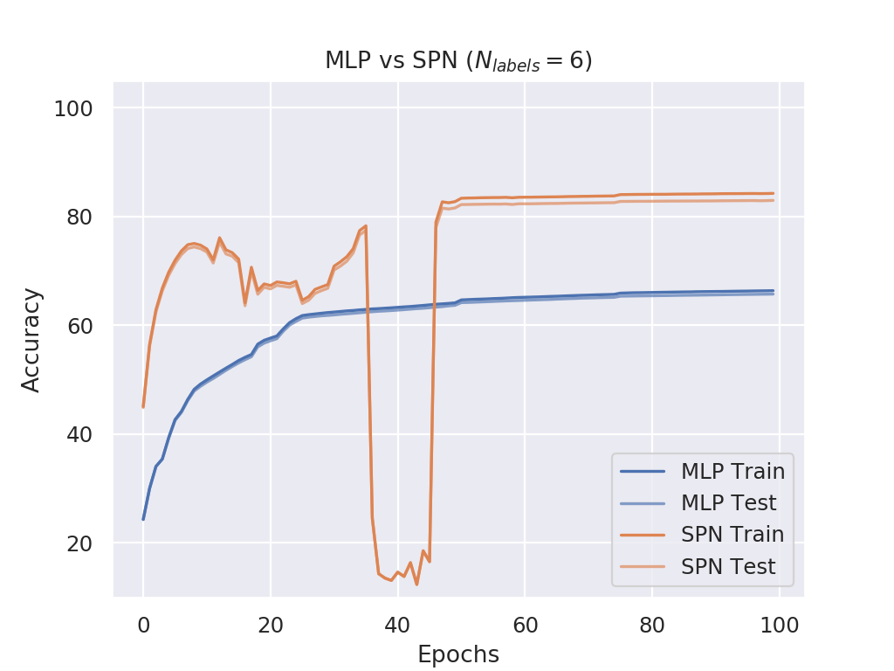
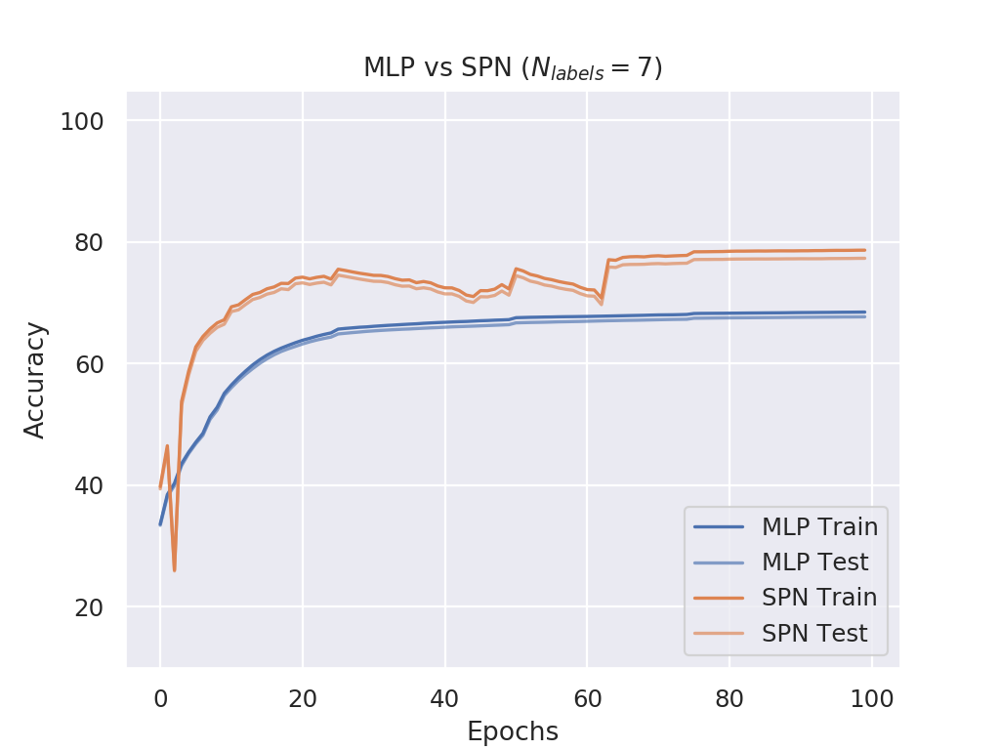
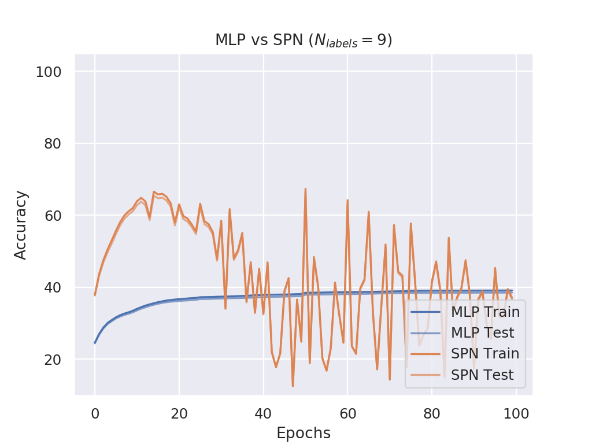
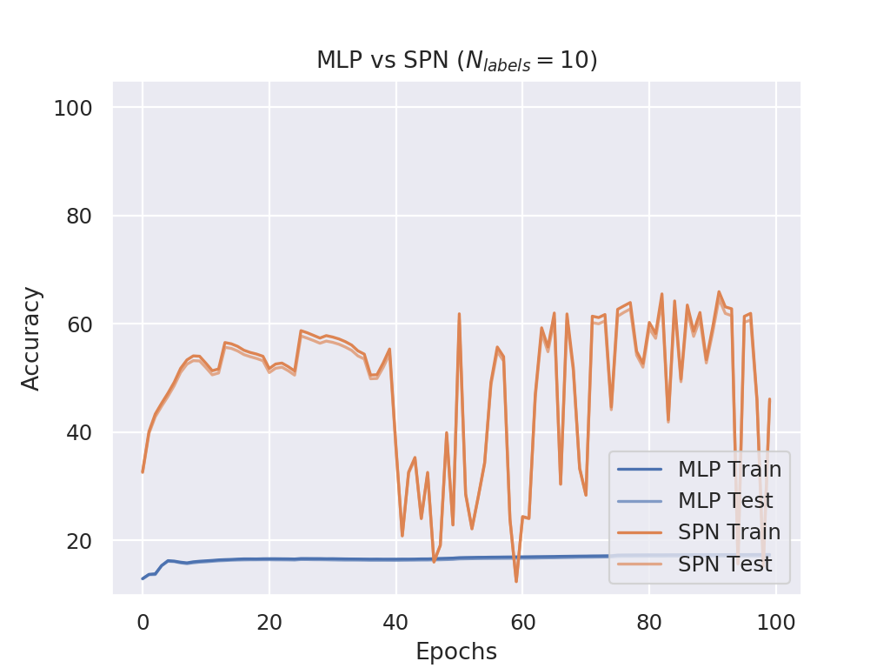

# Report: MLP vs SPN on MNIST Multilabel 

## Dataset

The MNIST dataset has been augmented such that each sample consists of multiple randomly composed digits, e.g. for 4 labels, the data looks like:

| Data Case | Image | Label |
| :-------: |-----|-----|
| 1 | | [2, 9, 7, 5]|
| 2 | | [6, 1, 2, 9]|
| ... | ... | ... |

## SPN Architecture

Each _SPN Layer_ (with dimensions *d\_in* and *d\_out*) is defined as follows:

- *d\_out* number of activations
- Each activation is a full SPN
- Each SPN has *d\_in* inputs and is defined as follows:
  - **Leaf Layer**: Each input is modeled with a single Gaussian
  - **Product Layer**: Select random pairs of leafs and model independencies via a product node
  - **Sum Layer**: Sum over all previous products with same scope
  - **Product Node (Root)**: Product over all mixtures

Example visualization with 6 input variables and a random selection of independencies:

## Experimental Setup

The experimental setup was as follows:

- Train for 100 epochs
- Batch size of 256
- Initial learning rate of 0.001
- Halven the learning rate after each 25 epochs

## Results

### Setup 1: One SPN Layer

**MLP**: Three layer perceptron

1) Linear Layer (*n\_in*, 32)
2) Linear Layer (32, 20)
3) Linear Layer (20, 10 * n_labels)

**SPN**: Same as MLP but replace the second linear layer with a custom SPN layer

1) Linear Layer (*n\_in*, 32)
2) SPN Layer (32, 20)
3) Linear Layer (20, 10 * n_labels)

#### N_labels = 1

#### N_labels = 2

#### N_labels = 3

#### N_labels = 4

#### N_labels = 5

#### N_labels = 6

#### N_labels = 7

#### N_labels = 8

#### N_labels = 9

#### N_labels = 10

