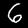
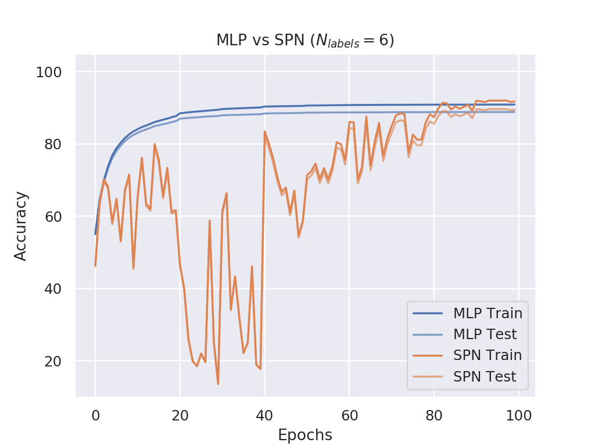

# Report: MLP vs SPN on MNIST Multilabel 

**Table of Contents**
- [Dataset](#dataset)
- [SPN Architecture](#spn-architecture)
- [Experimental Setup](#experimental-setup)
- [Results](#results)
  - [Setup 1: Single SPN Layer](#setup-1)
  - [Setup 2: Stacked SPN Layer](#setup-2)

## Dataset

The MNIST dataset has been augmented such that each sample consists of multiple randomly composed digits, e.g. for 4 labels, the data looks like:

| Data Case | Image | Label |
| :-------: |-----|-----|
| 1 | | [2, 9, 7, 5]|
| 2 | | [6, 1, 2, 9]|
| ... | ... | ... |

## SPN Architecture

Each _SPN Layer_ (with dimensions *d\_in* and *d\_out*) is defined as follows:

- *d\_out* number of activations
- Each activation is a full SPN
- Each SPN has *d\_in* inputs and is defined as follows:
  - **Leaf Layer**: Each input is modeled with a single Gaussian
  - **Product Layer**: Select random pairs of leafs and model independencies via a product node
  - **Sum Layer**: Sum over all previous products with same scope
  - **Product Node (Root)**: Product over all mixtures

Example visualization with 6 input variables and a random selection of pairwise independencies:

## Experimental Setup

The experimental setup was as follows:

- Train for 100 epochs
- Batch size of 256
- Initial learning rate of 0.001
- After 20 epochs, start halvening the learning rate after each 10 epochs

## Results

### Setup 1

Single SPN layer

**MLP**: Three layer perceptron

1) Linear Layer (*764 * n\_labels*, 32)
2) Linear Layer (32, 20)
3) Linear Layer (20, 10 * n_labels)

**SPN**: Same as MLP but replace the second linear layer with a custom SPN layer

1) Linear Layer (*764 * n\_labels*, 32)
2) SPN Layer (32, 20)
3) Linear Layer (20, 10 * n_labels)

**Summary**:

- The setup with the SPN as second layer performs better in terms of accuracy with large margins in all tasks
- The training process is by far not as stable as with only linear layers which can be seen in the results of *n_labels* > 4. These instablities over the epochs get worse when stacking SPNs as done in [Setup 2](#setup-2)
- For *n_labels* = 5 the network fluctuates a lot most of the time and seems to stablize towards the end with an accuracy of ~90% (vs ~40% without SPNs)

#### N_labels = 1

#### N_labels = 2

#### N_labels = 3

#### N_labels = 4

#### N_labels = 5

#### N_labels = 6

#### N_labels = 7

#### N_labels = 8

#### N_labels = 9

#### N_labels = 10

### Setup 2

Stacked SPNs

**MLP**: Four layer perceptron

1) Linear Layer (*764 * n\_labels*, 128)
2) Linear Layer (128, 64)
3) Linear Layer (64, 32)
4) Linear Layer (32, 10 * n_labels)

**SPN**: Same as MLP but replace the second and third linear layer with a custom SPN layer

1) Linear Layer (*764 * n\_labels*, 128)
2) SPN Layer (128, 64)
3) SPN Layer (64, 32)
4) Linear Layer (32, 10 * n_labels)

**Summary**:
- The network becomes instable for tasks with *n_labels* > 4 as can be seen in the fluctuating accuracy plots
- For *n_labels* > 5 the SPN network outperforms the MLP network after around 70 epochs
- In some cases (*n_labels* = 7, 10) the effect of the learning rate halvening after every 10 epochs becomes very visible and strongly influences the learning process. After the learning rate is halvened the performance quickly improves and falls back down afterwards

#### N_labels = 1

#### N_labels = 2

#### N_labels = 3

#### N_labels = 4

#### N_labels = 5

#### N_labels = 6

#### N_labels = 7

#### N_labels = 8

#### N_labels = 9

#### N_labels = 10

