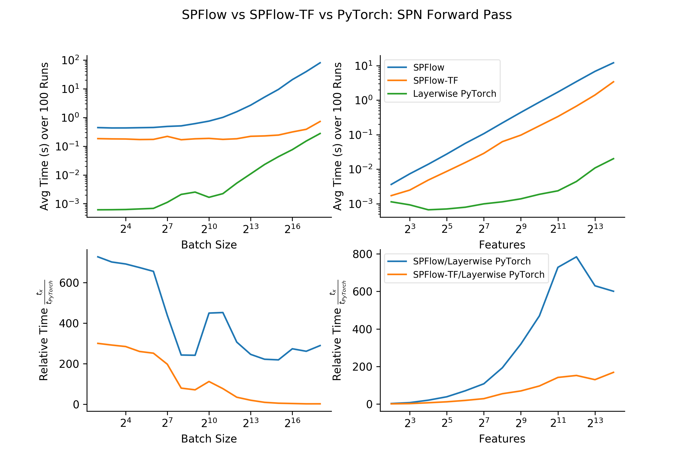

# Layerwise SPN Implementation

# Benchmark



The architecture below has been used to benchmark the runtime with varying number of input features (batch size = 1024) and varying batch size (number of input features = 1024).

### Visualized


### Internal Computation for a Single Data Case

_Input:_

| Scope {1} | Scope {2} | Scope {3} | Scope {4} |
| :---:     | :---:     | :---:     | :---:     |
| x1        | x2        | x3        | x4        |

_Gaussian Layer (multiplicity=2):_

| Scope {1} | Scope {2} | Scope {3} | Scope {4} |
| :---:     | :---:     | :---:     | :---:     |
| x11       | x21       | x31       | x41       |
| x12       | x22       | x32       | x42       |

_Product Layer (cardinality=2):_

| Scope {1,2} | Scope {3,4} |
| :---:       | :---:       |
| x11 * x21   | x31 * x41   |
| x12 * x22   | x32 * x42   |

_Sum Layer:_

| Scope {1,2}                       | Scope {3,4}                       |
| :---:                             | :---:                             |
| x11 * x21 * w11 + x12 * x22 * w12 | x31 * x41 * w21 + x32 * x42 * w22 |

_Product Layer (cardinality=2):_

| Scope {1,2,3,4}                                                           |
| :---:                                                                     |
| (x11 * x21 * w11 + x12 * x22 * w12) * (x31 * x41 * w21 + x32 * x42 * w22) |

### Equivalent Code:
```python
from src.spn.distributions import Normal
from src.spn.layers import Sum, Product
import torch
from torch import nn

# 1 Sample, 4 features, 1 channel
x = torch.rand(1, 4, 1)

# Create SPN layers
gauss = Normal(multiplicity=2, in_features=4, in_channels=1)
prod1 = Product(in_features=4, cardinality=2)
sum1 = Sum(in_features=2, in_channels=2, out_channels=1)
prod2 = Product(in_features=2, cardinality=2)

# Stack SPN layers
spn = nn.Sequential(gauss, prod1, sum1, prod2)

logprob = spn(x)
print(logprob)
# => tensor([[-5.1142]], grad_fn=<SumBackward2>)
```
